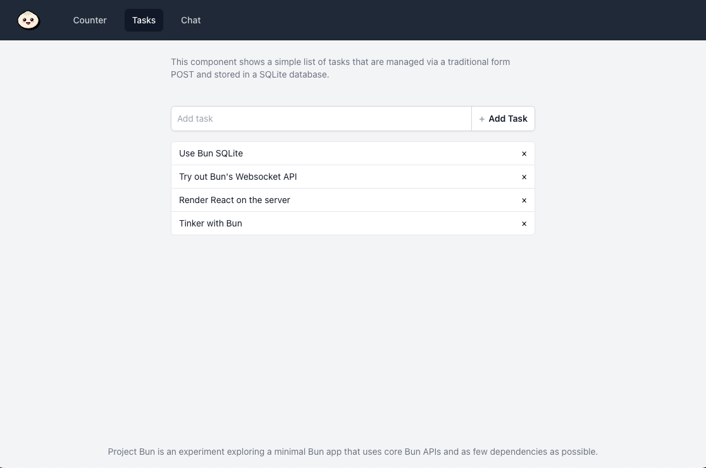

# Project Bun



Project Bun is an experiment exploring a minimal Bun app that uses core Bun APIs and as few dependencies as possible.

It includes:

- A vanilla [Bun HTTP server](https://bun.sh/docs/api/http) that handles requests, including:
  - form posts
  - streaming React from the server using the [`renderToReadableStream`](https://react.dev/reference/react-dom/server/renderToReadableStream) API
  - a [websocket server](https://bun.sh/docs/api/websockets)
  - serving a client-side bundle using [`Bun.build`](https://bun.sh/docs/bundler) that hydrates the server-rendered React
- A basic example using a counter to increment and decrement a counter stored in global state
- A basic example using server-rendered react that lets you create tasks via traditional form posts and store them in a SQLite database using Bun's [native SQLite driver](https://bun.sh/docs/api/sqlite)
- A basic chat app that hydrates React on the client, connects to the [Bun websocket server](https://bun.sh/docs/api/websockets) and allows a user to send messages
- Watchs and reloads the dev server using [Bun watch](https://bun.sh/docs/runtime/hot)

Bun has a lot of interesting APIs that are surprisingly capable and fun to build with. The only dependencies used are React and React DOM.

_Obligatory Disclaimer_: this was purely for fun, is not production ready, and should be used for reference only.

## Development

To install dependencies:

```bash
bun install
```

To run:

```bash
bun migrate src/db/migrations/2024-10-04-tasks.sql # migrate the tiny sqlite database
bun dev
```

This project was created using `bun init` in bun v1.1.29. [Bun](https://bun.sh) is a fast all-in-one JavaScript runtime.
